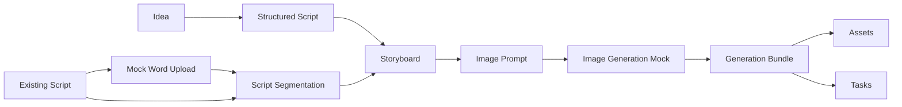

# ManJuFlow

[中文](README.zh-CN.md) | [English](README.en.md)


## Hero

**ManJuFlow** is an AI-powered cinematic storytelling workflow platform for short drama, manhua-style visual storytelling, and AI-assisted media production.

Transform ideas or existing scripts into structured scripts, storyboards, image prompts, mock generation bundles, assets, and task-ready creative outputs.

Current stage: **Active MVP Development｜Phase 5 Text-to-Prompt Workbench**

## Project Positioning

ManJuFlow is an AI-powered cinematic content production workflow platform. It helps transform creative ideas or existing scripts into structured intermediate assets that can be consumed by downstream media generation tools.

The current focus is not automated film generation. The project is first stabilizing the text-to-prompt pipeline, structured storyboarding, prompt generation, mock image generation, asset and task containers, script upload boundaries, workspace UI, and public repository safety rules.

ManJuFlow is built for short drama, manhua-style visual storytelling, and visual content production workflows. It is designed for non-technical creative teams, supports both idea-first creation and existing-script workflows, and is currently intended for technical review, project showcase, and collaboration discussion.

## Current Capabilities

### Phase 1｜Idea → Script

- Idea input;
- Structured short-drama script output;
- `POST /api/scripts/generate`;
- Frontend display, copy, export;
- mock / llm modes.

### Phase 2｜Script → Storyboard

- Script-to-storyboard generation;
- `StoryboardOutput`;
- `POST /api/storyboards/generate`;
- Frontend storyboard display;
- Script result can be passed into storyboard generation;
- Storyboard JSON copy / export.

### Phase 3｜Storyboard → ImagePrompt

- Storyboard-to-image-prompt generation;
- `ImagePromptInput` / `ImagePromptOutput`;
- `POST /api/prompts/generate`;
- Multiple text LLM providers;
- Prompt output language: Chinese / English;
- Frontend display, copy, export.

### Phase 4｜ImagePrompt → ImageGeneration Mock / Bundle

- ImageGeneration mock;
- `ImageGenerationBundleOutput`;
- Asset / RenderTask mock structures;
- `POST /api/images/generate`;
- `POST /api/images/generate-bundle`;
- AppShell / Sidebar / Toast;
- ComfyUI / remote GPU private deployment design docs.

### Phase 5｜Text-to-Prompt Workbench

- Existing script segmentation schema / service / endpoint;
- Frontend Existing Script workspace;
- Mock Word script upload;
- `extracted_text` auto-fill into segmentation workspace;
- Script segmentation result can be passed into storyboard generation;
- Workspace Context Isolation design;
- Upload / Auth / UsageLedger design;
- Frontend localization guide;
- Bilingual README upgrade plan.

## Workflow Overview



## Technical Architecture

Backend:

- Python;
- FastAPI;
- Pydantic;
- `schemas` / `services` / `routers`;
- versioned prompt files;
- OpenAI-compatible `LLMClient`;
- mock / llm generation modes;
- provider configuration boundaries;
- pytest coverage.

Frontend:

- React;
- Vite;
- TypeScript;
- AppShell;
- Sidebar;
- Workspace UI;
- Toast notifications;
- `ScriptSegmentationWorkspace`;
- Chinese-first UI;
- Prompt output language selection: Chinese / English.

Engineering principles:

- Modular first;
- Data contract first;
- Mock-first;
- Local-first development;
- Each feature delivered as a small testable loop;
- Avoid premature heavy infrastructure;
- Public repository safety boundary first.

## Local Development

Use your own local clone path.

Backend:

```bash
cd /path/to/ManJuFlow
bash scripts/dev_api.sh
```

Clean port and restart backend:

```bash
cd /path/to/ManJuFlow
bash scripts/kill_api_port.sh
bash scripts/dev_api.sh
```

Frontend:

```bash
cd /path/to/ManJuFlow/apps/web
npm run dev
```

Backend tests:

```bash
cd /path/to/ManJuFlow
python -m pytest tests/api
```

Frontend build:

```bash
cd /path/to/ManJuFlow/apps/web
npm run build
```

Do not commit `.env`, API keys, real customer data, or private deployment settings.

## Project Structure

```text
ManJuFlow/
├── apps/
│   ├── api/
│   │   └── app/
│   │       ├── schemas/
│   │       ├── services/
│   │       ├── routers/
│   │       └── prompts/
│   └── web/
│       └── src/
│           ├── api/
│           ├── types/
│           ├── components/
│           │   ├── layout/
│           │   └── workspaces/
│           └── App.tsx
├── docs/
├── examples/
├── scripts/
├── tests/
└── README.md
```

- `apps/api`: FastAPI backend;
- `apps/web`: React + Vite frontend;
- `docs`: phase docs, design docs, runbooks, safety boundaries;
- `tests/api`: backend schema / service / endpoint tests;
- `scripts`: local development scripts;
- `examples`: safe example inputs / outputs.

## API Overview

- `GET /health`
- `GET /api/system/status`
- `POST /api/scripts/generate`
- `POST /api/scripts/segment`
- `POST /api/storyboards/generate`
- `POST /api/prompts/generate`
- `POST /api/images/generate`
- `POST /api/images/generate-bundle`
- `POST /api/uploads/script`

Notes:

- `/api/uploads/script` is currently a JSON mock metadata-only upload endpoint, not a real multipart file upload endpoint.
- `/api/images/generate` and `/api/images/generate-bundle` are currently mock endpoints and do not connect to real ComfyUI / GPU infrastructure.

## Safety Boundary and Usage Notice

This public repository is intended for:

- technical review;
- project showcase;
- collaboration discussion.

Important:

- Public visibility does not imply open-source authorization.
- This repository currently does not grant an open-source license.
- Commercial use, redistribution, sublicensing, or production deployment is not permitted without written permission.
- Real API keys, `.env` files, customer data, employee data, real server addresses, private workflows, and model weights must not be committed.
- Real ComfyUI / GPU / workflow / customer assets should be managed in private deployment environments.

The public repository may contain:

- schemas;
- mock services;
- mock endpoints;
- provider interfaces;
- placeholders;
- docs and runbooks;
- safe fictional examples;
- local demo code.

The public repository must not contain:

- API keys;
- `.env`;
- SSH keys;
- real customer scripts;
- real employee information;
- real server addresses;
- private ComfyUI workflows;
- model weights;
- production output assets.

## Roadmap

Planned directions:

- Real `.docx` file upload and text extraction;
- Mock Internal Auth;
- Assistant Chat with DeepSeek-first but provider-extensible design;
- Assistant suggested actions;
- UsageLedger for usage and RMB cost estimation;
- Prompt versioning / translate current prompt;
- Default README landing page upgrade;
- Private ComfyUI small-sample integration;
- Asset Manager / Task Center improvements;
- Workspace / Project Context Isolation implementation;
- Private deployment and permission system.

## Documentation

- [API Contract](docs/API_CONTRACT.md)
- [Local Dev](docs/LOCAL_DEV.md)
- [MVP Roadmap](docs/MVP_ROADMAP.md)
- [Project Structure Refactor Plan](docs/PROJECT_STRUCTURE_REFACTOR_PLAN.md)
- [Frontend Localization and Prompt Language Guide](docs/FRONTEND_LOCALIZATION_AND_PROMPT_LANGUAGE_GUIDE.md)
- [Cooperation Tech Asset Boundary Draft](docs/COOPERATION_TECH_ASSET_BOUNDARY_DRAFT.md)
- [README Bilingual Upgrade Plan](docs/README_BILINGUAL_UPGRADE_PLAN.md)
- [Phase 3 Summary](docs/PHASE_3_SUMMARY.md)
- [Phase 4 Summary](docs/PHASE_4_SUMMARY.md)
- [Phase 5 Text-to-Prompt Workbench Plan](docs/PHASE_5_TEXT_TO_PROMPT_WORKBENCH_PLAN.md)

## Current Status

ManJuFlow is under active MVP development.

This public repository demonstrates the reviewable, runnable, and migratable engineering backbone of the project, with mock-first workflows and clear safety boundaries. Real production deployment, real accounts, real customer data, real GPU / ComfyUI infrastructure, and private workflows should be configured in private environments.
