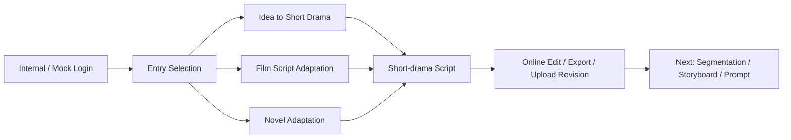

# ManJuFlow

[中文](README.zh-CN.md) | [English](README.en.md)


## Hero

**ManJuFlow** is currently being redesigned as an AI-powered short-drama script generation and adaptation workbench for writers, short-drama planners, and manhua-style content teams.

Users will log in, choose one of three creation entries, generate or adapt a short-drama script, edit it online, export or download it, upload revisions, and then optionally continue into script segmentation, storyboarding, and prompt generation.

Current stage: **Active MVP Development｜Phase 5 Three-entry Short-drama Script Workbench**

## Project Positioning

ManJuFlow is currently being redesigned as a three-entry short-drama script generation and adaptation workbench. It helps transform ideas, film scripts, or novels into editable short-drama scripts that can later flow into segmentation, storyboarding, and prompt generation.

The current focus is not automated film generation, image generation, or video generation. The project is first stabilizing short-drama script generation, adaptation, online editing, document round-trip, upload boundaries, Assistant-assisted rewriting, workspace UI, and public repository safety rules.

ManJuFlow is built for short drama, manhua-style visual storytelling, and visual content production workflows. It is designed for non-technical creative teams, supports both idea-first creation and existing-script workflows, and is currently intended for technical review, project showcase, and collaboration discussion.

## Current Capabilities

### Phase 1｜Idea → Script

- Idea input;
- Structured short-drama script output;
- `POST /api/scripts/generate`;
- Frontend display, copy, export;
- mock / llm modes.

### Phase 2｜Script → Storyboard

- Script-to-storyboard generation;
- `StoryboardOutput`;
- `POST /api/storyboards/generate`;
- Frontend storyboard display;
- Script result can be passed into storyboard generation;
- Storyboard JSON copy / export.

### Phase 3｜Storyboard → ImagePrompt

- Storyboard-to-image-prompt generation;
- `ImagePromptInput` / `ImagePromptOutput`;
- `POST /api/prompts/generate`;
- Multiple text LLM providers;
- Prompt output language: Chinese / English;
- Frontend display, copy, export.

### Phase 4｜ImagePrompt → ImageGeneration Mock / Bundle

- ImageGeneration mock;
- `ImageGenerationBundleOutput`;
- Asset / RenderTask mock structures;
- `POST /api/images/generate`;
- `POST /api/images/generate-bundle`;
- AppShell / Sidebar / Toast;
- ComfyUI / remote GPU private deployment design docs.

### Phase 5｜Three-entry Short-drama Script Workbench

- Existing script segmentation schema / service / endpoint;
- Frontend Existing Script workspace;
- Mock Word script upload;
- `extracted_text` auto-fill into segmentation workspace;
- Script segmentation result can be passed into storyboard generation;
- Workspace Context Isolation design;
- Upload / Auth / UsageLedger design;
- Frontend localization guide;
- Bilingual README upgrade plan.

### Phase 5 Update｜Three-entry Short-drama Script Workbench

The Phase 5 product direction has been adjusted to a three-entry short-drama script workbench:

- Idea to Short Drama Script: based on the existing Idea → Script capability, with stronger short-drama episode, hook, and scene structure requirements;
- Film Script Adaptation: planned next, mock-first, with independent prompt and source_mode;
- Novel Adaptation: planned next, mock-first, with independent prompt and source_mode.

Script segmentation, storyboarding, and ImagePrompt generation remain important, but they are now positioned as the next major capability after short-drama script generation. Image generation and video generation are not the current market-trial focus.

## Current Primary Entries

Planned workbench flow:

1. Internal account / mock login;
2. Entry selection page;
3. Choose one creation mode:
   - Idea to Short Drama Script;
   - Film Script to Short Drama;
   - Novel to Short Drama;
4. Enter the corresponding generation / adaptation page;
5. Edit the generated short-drama script online;
6. Download DOCX / TXT / JSON or upload a revised draft;
7. Optionally continue to script segmentation, storyboard, and prompt generation.

## AI Assistant Positioning

The AI Assistant is not a generic chat box. It is a writer assistant, adaptation assistant, and workflow assistant.

It should help users:

- rewrite ideas;
- extract film adaptation strategies;
- summarize novel character relationships;
- strengthen short-drama hooks;
- move current results into the next workflow step;
- execute suggested actions only after user confirmation.

The Assistant must remain independent from the three primary generation flows, with separate schema / service / endpoint / prompt / environment configuration.

## Workflow Overview



## Technical Architecture

Backend:

- Python;
- FastAPI;
- Pydantic;
- `schemas` / `services` / `routers`;
- versioned prompt files;
- OpenAI-compatible `LLMClient`;
- mock / llm generation modes;
- provider configuration boundaries;
- pytest coverage.

Frontend:

- React;
- Vite;
- TypeScript;
- AppShell;
- Sidebar;
- Workspace UI;
- Toast notifications;
- `ScriptSegmentationWorkspace`;
- Chinese-first UI;
- Prompt output language selection: Chinese / English.

Engineering principles:

- Modular first;
- Data contract first;
- Mock-first;
- Local-first development;
- Each feature delivered as a small testable loop;
- Avoid premature heavy infrastructure;
- Public repository safety boundary first.

## Local Development

Use your own local clone path.

Backend:

```bash
cd /path/to/ManJuFlow
bash scripts/dev_api.sh
```

Clean port and restart backend:

```bash
cd /path/to/ManJuFlow
bash scripts/kill_api_port.sh
bash scripts/dev_api.sh
```

Frontend:

```bash
cd /path/to/ManJuFlow/apps/web
npm run dev
```

Backend tests:

```bash
cd /path/to/ManJuFlow
python -m pytest tests/api
```

Frontend build:

```bash
cd /path/to/ManJuFlow/apps/web
npm run build
```

Do not commit `.env`, API keys, real customer data, or private deployment settings.

## Project Structure

```text
ManJuFlow/
├── apps/
│   ├── api/
│   │   └── app/
│   │       ├── schemas/
│   │       ├── services/
│   │       ├── routers/
│   │       └── prompts/
│   └── web/
│       └── src/
│           ├── api/
│           ├── types/
│           ├── components/
│           │   ├── layout/
│           │   └── workspaces/
│           └── App.tsx
├── docs/
├── examples/
├── scripts/
├── tests/
└── README.md
```

- `apps/api`: FastAPI backend;
- `apps/web`: React + Vite frontend;
- `docs`: phase docs, design docs, runbooks, safety boundaries;
- `tests/api`: backend schema / service / endpoint tests;
- `scripts`: local development scripts;
- `examples`: safe example inputs / outputs.

## API Overview

- `GET /health`
- `GET /api/system/status`
- `POST /api/scripts/generate`
- `POST /api/scripts/segment`
- `POST /api/storyboards/generate`
- `POST /api/prompts/generate`
- `POST /api/images/generate`
- `POST /api/images/generate-bundle`
- `POST /api/uploads/script`

Notes:

- `/api/uploads/script` is currently a JSON mock metadata-only upload endpoint, not a real multipart file upload endpoint.
- `/api/images/generate` and `/api/images/generate-bundle` are currently mock endpoints and do not connect to real ComfyUI / GPU infrastructure.

## Safety Boundary and Usage Notice

This public repository is intended for:

- technical review;
- project showcase;
- collaboration discussion.

Important:

- Public visibility does not imply open-source authorization.
- This repository currently does not grant an open-source license.
- Commercial use, redistribution, sublicensing, or production deployment is not permitted without written permission.
- Real API keys, `.env` files, customer data, employee data, real server addresses, private workflows, and model weights must not be committed.
- Real ComfyUI / GPU / workflow / customer assets should be managed in private deployment environments.

The public repository may contain:

- schemas;
- mock services;
- mock endpoints;
- provider interfaces;
- placeholders;
- docs and runbooks;
- safe fictional examples;
- local demo code.

The public repository must not contain:

- API keys;
- `.env`;
- SSH keys;
- real customer scripts;
- real employee information;
- real server addresses;
- private ComfyUI workflows;
- model weights;
- production output assets.

## Roadmap

Planned directions:

- Three-entry schema / prompt / source_mode registry;
- Film script to short-drama mock / llm flow;
- Novel to short-drama mock / llm flow;
- Frontend entry selection page;
- Real `.docx` file upload and text extraction;
- Online editing and DOCX download;
- Mock Internal Auth;
- Assistant as writer / adaptation / workflow assistant;
- Assistant suggested actions;
- UsageLedger for usage and RMB cost estimation;
- Script segmentation / storyboard / prompt as the next major capability;
- README maintenance and documentation synchronization;
- Private ComfyUI small-sample integration;
- Asset Manager / Task Center improvements;
- Workspace / Project Context Isolation implementation;
- Private deployment and permission system.

## Documentation

- [API Contract](docs/API_CONTRACT.md)
- [Local Dev](docs/LOCAL_DEV.md)
- [MVP Roadmap](docs/MVP_ROADMAP.md)
- [Project Structure Refactor Plan](docs/PROJECT_STRUCTURE_REFACTOR_PLAN.md)
- [Frontend Localization and Prompt Language Guide](docs/FRONTEND_LOCALIZATION_AND_PROMPT_LANGUAGE_GUIDE.md)
- [Cooperation Tech Asset Boundary Draft](docs/COOPERATION_TECH_ASSET_BOUNDARY_DRAFT.md)
- [README Bilingual Upgrade Plan](docs/README_BILINGUAL_UPGRADE_PLAN.md)
- [Phase 3 Summary](docs/PHASE_3_SUMMARY.md)
- [Phase 4 Summary](docs/PHASE_4_SUMMARY.md)
- [Phase 5 Text-to-Prompt Workbench Plan](docs/PHASE_5_TEXT_TO_PROMPT_WORKBENCH_PLAN.md)

## Current Status

ManJuFlow is under active MVP development.

This public repository demonstrates the reviewable, runnable, and migratable engineering backbone of the project, with mock-first workflows and clear safety boundaries. Real production deployment, real accounts, real customer data, real GPU / ComfyUI infrastructure, and private workflows should be configured in private environments.
