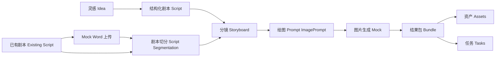

# ManJuFlow｜漫剧流

[中文](README.zh-CN.md) | [English](README.en.md)


## Hero

**ManJuFlow｜漫剧流** 是一个面向短剧 / 漫剧 / AI 影视化内容生产的创作流水线平台。

从灵感或已有剧本出发，生成结构化剧本、分镜、绘图 Prompt、图片生成 Mock、资产与任务结果包。

当前阶段：**Active MVP Development｜Phase 5 Text-to-Prompt Workbench**

## 项目定位

ManJuFlow 是一个 AI 影视化创作流水线平台，用于把灵感或已有剧本逐步转化为可被后续媒体生成工具消费的结构化内容。

当前项目重点不是直接“自动成片”，而是先把文字生产、分镜、Prompt、Mock 图片生成、资产任务承载、上传、工作台和安全边界打稳。它面向短剧、漫剧和视觉内容生产场景，重点服务非技术内容团队，让编剧、导演、美术、制片和运营人员可以通过网页工作台完成可追踪、可评审、可交接的前期创作链路。

当前公开仓库用于技术评审、项目展示和合作沟通。真实客户数据、真实账号、真实 ComfyUI / GPU 配置、私有 workflow 和模型权重应留在私有部署环境。

## 当前已完成能力

### Phase 1｜Idea → Script

- 灵感输入；
- 结构化短剧剧本输出；
- `POST /api/scripts/generate`；
- 前端展示、复制、导出；
- mock / llm 模式。

### Phase 2｜Script → Storyboard

- 剧本转导演分镜；
- `StoryboardOutput`；
- `POST /api/storyboards/generate`；
- 前端分镜展示；
- 剧本结果带入分镜；
- 分镜 JSON 复制 / 导出。

### Phase 3｜Storyboard → ImagePrompt

- 分镜转 AI 绘图 Prompt；
- `ImagePromptInput` / `ImagePromptOutput`；
- `POST /api/prompts/generate`；
- 多文本 LLM provider；
- Prompt 中文 / 英文输出；
- 前端展示、复制、导出。

### Phase 4｜ImagePrompt → ImageGeneration Mock / Bundle

- ImageGeneration mock；
- `ImageGenerationBundleOutput`；
- Asset / RenderTask mock；
- `POST /api/images/generate`；
- `POST /api/images/generate-bundle`；
- AppShell / Sidebar / Toast；
- ComfyUI / 远端 GPU 私有部署文档。

### Phase 5｜Text-to-Prompt Workbench

- 已有剧本切分 Schema / Service / Endpoint；
- 前端“已有剧本”工作区；
- Mock Word 剧本文档上传；
- `extracted_text` 自动填入切分区；
- 切分结果带入分镜；
- Workspace Context Isolation 设计；
- 上传 / Auth / UsageLedger 设计；
- 前端中文化规范；
- README 双语升级规划。

## 工作流概览



## 技术架构

后端：

- Python；
- FastAPI；
- Pydantic；
- `schemas` / `services` / `routers` 分层；
- Prompt 文件版本化；
- OpenAI-compatible `LLMClient`；
- mock / llm generation mode；
- provider 配置边界；
- pytest 测试。

前端：

- React；
- Vite；
- TypeScript；
- AppShell；
- Sidebar；
- Workspace UI；
- Toast；
- `ScriptSegmentationWorkspace`；
- 中文 UI；
- Prompt 中文 / 英文输出。

工程原则：

- 模块化优先；
- 数据协议优先；
- mock-first；
- 先本地跑通；
- 每个小闭环可测试；
- 不过早引入复杂基础设施；
- 公开仓库安全边界优先。

## 本地快速启动

路径请根据本地 clone 位置调整。

后端启动：

```bash
cd /path/to/ManJuFlow
bash scripts/dev_api.sh
```

清理端口并重启后端：

```bash
cd /path/to/ManJuFlow
bash scripts/kill_api_port.sh
bash scripts/dev_api.sh
```

前端启动：

```bash
cd /path/to/ManJuFlow/apps/web
npm run dev
```

后端测试：

```bash
cd /path/to/ManJuFlow
python -m pytest tests/api
```

前端构建：

```bash
cd /path/to/ManJuFlow/apps/web
npm run build
```

不要把 `.env`、API Key、真实客户数据提交到 Git。

## 项目结构

```text
ManJuFlow/
├── apps/
│   ├── api/
│   │   └── app/
│   │       ├── schemas/
│   │       ├── services/
│   │       ├── routers/
│   │       └── prompts/
│   └── web/
│       └── src/
│           ├── api/
│           ├── types/
│           ├── components/
│           │   ├── layout/
│           │   └── workspaces/
│           └── App.tsx
├── docs/
├── examples/
├── scripts/
├── tests/
└── README.md
```

- `apps/api`：FastAPI 后端；
- `apps/web`：React + Vite 前端；
- `docs`：阶段文档、设计文档、runbook、安全边界；
- `tests/api`：后端测试；
- `scripts`：本地开发脚本；
- `examples`：安全示例。

## API 概览

- `GET /health`
- `GET /api/system/status`
- `POST /api/scripts/generate`
- `POST /api/scripts/segment`
- `POST /api/storyboards/generate`
- `POST /api/prompts/generate`
- `POST /api/images/generate`
- `POST /api/images/generate-bundle`
- `POST /api/uploads/script`

说明：

- `/api/uploads/script` 当前是 JSON mock metadata-only upload，不是真实 multipart 文件上传；
- `/api/images/generate` 和 `/api/images/generate-bundle` 当前是 mock，不接真实 ComfyUI / GPU。

## 安全边界与 Usage Notice

当前公开仓库仅用于：

- 技术评审；
- 项目展示；
- 合作沟通。

重要说明：

- Public visibility does not imply open-source authorization；
- 当前仓库暂未授予开源许可证；
- 未经书面许可，不得商业使用、再分发、转授权或生产部署；
- 真实 API Key、`.env`、客户数据、员工数据、真实服务器信息、私有 workflow、模型权重不进入公开仓库；
- 真实 ComfyUI / GPU / workflow / 客户资产应放在私有部署环境。

公开仓库可以包含：

- Schema；
- mock service；
- mock endpoint；
- provider interface；
- placeholder；
- 文档和 runbook；
- 安全的虚构样例；
- 本地 demo。

公开仓库不能包含：

- API Key；
- `.env`；
- SSH Key；
- 真实客户剧本；
- 真实员工信息；
- 真实服务器地址；
- 私有 ComfyUI workflow；
- 模型权重；
- 生产输出资产；
- 合作方敏感信息。

## Roadmap

后续方向：

- 真实 `.docx` 文件上传与文本解析；
- Mock Internal Auth；
- Assistant Chat with DeepSeek-first but provider-extensible design；
- Assistant suggested actions；
- UsageLedger 用量与人民币成本估算；
- Prompt 版本管理 / 当前 Prompt 翻译；
- README 后续维护与文档同步；
- 私有 ComfyUI 小样本联调；
- Asset Manager / Task Center 深化；
- Workspace / Project Context Isolation 落地；
- 私有部署与权限系统。

## 文档导航

- [API Contract](docs/API_CONTRACT.md)
- [Local Dev](docs/LOCAL_DEV.md)
- [MVP Roadmap](docs/MVP_ROADMAP.md)
- [Project Structure Refactor Plan](docs/PROJECT_STRUCTURE_REFACTOR_PLAN.md)
- [Frontend Localization and Prompt Language Guide](docs/FRONTEND_LOCALIZATION_AND_PROMPT_LANGUAGE_GUIDE.md)
- [Cooperation Tech Asset Boundary Draft](docs/COOPERATION_TECH_ASSET_BOUNDARY_DRAFT.md)
- [README Bilingual Upgrade Plan](docs/README_BILINGUAL_UPGRADE_PLAN.md)
- [Phase 3 Summary](docs/PHASE_3_SUMMARY.md)
- [Phase 4 Summary](docs/PHASE_4_SUMMARY.md)
- [Phase 5 Text-to-Prompt Workbench Plan](docs/PHASE_5_TEXT_TO_PROMPT_WORKBENCH_PLAN.md)

## 当前状态说明

ManJuFlow 仍处于 active MVP development。

当前公开仓库展示的是可评审、可运行、可迁移的工程主干和 mock-first 闭环。真实生产部署、真实账号、真实客户数据、真实 GPU / ComfyUI、真实 workflow 需要进入私有环境单独配置。
