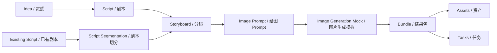

# README Bilingual Upgrade Plan｜GitHub 双语主页升级计划

## 1. 设计目标

README 将作为 GitHub 默认项目主页，用于：

- 合作洽谈；
- 投资评估；
- 技术评审；
- 项目交接；
- 私有部署前的工程能力展示。

README 需要做到：

- 专业；
- 高级；
- 中英双语；
- 结构清晰；
- 展示当前真实能力；
- 明确公开仓库安全边界；
- 不夸大未完成能力。

README 不是营销稿，也不是生产部署手册。它应准确呈现 ManJuFlow 当前作为 AI 影视化创作流水线 MVP 的阶段性能力、工程质量、模块边界和后续路线。

## 2. 推荐双语结构

推荐采用三个文件：

- `README.md`：GitHub 默认入口页，包含项目概览和语言切换；
- `README.zh-CN.md`：中文完整主页；
- `README.en.md`：英文完整主页。

`README.md` 顶部提供：

```markdown
[中文](README.zh-CN.md) | [English](README.en.md)
```

说明：

- GitHub README 不能像网页一样做真正交互式语言切换；
- 可以通过链接实现自由切换；
- `README.md` 保持简洁，避免维护三份完全重复内容；
- 中文和英文完整页可以根据受众分别调整表达重点，但事实、能力和安全边界必须一致。

## 3. README.md 建议结构

建议 `README.md` 作为默认入口页，包含以下内容。

### 1. Hero 区域

- 项目名：`ManJuFlow｜漫剧流`
- 一句话 slogan；
- badges 占位；
- 语言切换；
- 当前阶段说明。

建议强调：

```text
AI 影视化创作流水线平台｜从灵感或已有剧本出发，生成剧本、分镜、绘图 Prompt、图片生成 mock、资产与任务结果包。
```

### 2. 项目定位

说明 ManJuFlow 是：

- AI 影视化创作流水线平台；
- 面向短剧 / 漫剧 / 视觉内容生产；
- 支持从灵感或已有剧本进入工作流；
- 面向非技术内容团队的模块化创作工作台；
- 当前处于 active MVP development，不是生产级商业系统。

### 3. 当前完成能力

应准确列出当前已完成能力：

- Idea → Script；
- Script → Storyboard；
- Storyboard → ImagePrompt；
- ImagePrompt → ImageGeneration Mock；
- ImageGeneration Bundle；
- Asset / Task mock 承载；
- Existing Script → Script Segmentation；
- Mock Script Upload；
- Workspace / Sidebar / Toast；
- Multi-provider text LLM for content generation；
- Prompt 中文 / 英文输出；
- 前端主要 UI 中文化；
- 公开仓库安全边界与私有部署文档。

### 4. 工作流图

建议用 Mermaid：



### 5. 技术架构

后端：

- FastAPI；
- Pydantic；
- mock / llm generation modes；
- OpenAI-compatible `LLMClient`；
- modular schemas / services / routers；
- provider / adapter 边界；
- 后端 pytest 测试。

前端：

- React；
- Vite；
- TypeScript；
- AppShell / Sidebar；
- Workspace UI；
- Toast Notification；
- 已拆分 `ScriptSegmentationWorkspace`；
- 中文 UI + Prompt 语言选择。

### 6. 本地快速启动

列出：

- backend start；
- frontend start；
- backend tests；
- frontend build。

注意：

- 命令应与当前仓库真实脚本一致；
- 如果保留本机路径示例，应提示用户根据本地 clone 路径调整；
- 不写 `.env` 真实值；
- 不写 API Key。

### 7. 项目结构

展示当前结构：

```text
apps/
  api/
  web/
docs/
tests/
scripts/
examples/
```

说明：

- `apps/api` 是 FastAPI 后端；
- `apps/web` 是 React + Vite 前端；
- `docs` 保存阶段计划、设计文档、runbook、合作边界；
- `tests/api` 保存后端 schema / service / endpoint 测试；
- `scripts` 保存本地开发脚本；
- `examples` 保存安全示例。

同时说明：

- `storage/` 不进入 Git；
- `.env` 不进入 Git；
- API Key 不进入 Git；
- 真实客户文件、员工数据、生产输出不进入公开仓库。

### 8. API 概览

列出当前主要 endpoint：

- `GET /health`
- `GET /api/system/status`
- `POST /api/scripts/generate`
- `POST /api/scripts/segment`
- `POST /api/storyboards/generate`
- `POST /api/prompts/generate`
- `POST /api/images/generate`
- `POST /api/images/generate-bundle`
- `POST /api/uploads/script`

说明：

- `/api/uploads/script` 当前是 JSON mock metadata-only upload，不是真实 multipart 文件上传；
- `/api/images/generate` 和 `/api/images/generate-bundle` 当前仍为 mock，不接真实 ComfyUI / GPU。

### 9. 安全边界 / Usage Notice

必须明确：

- 当前公开仓库仅用于技术评审、项目展示和合作沟通；
- 未经书面许可不得商业使用、再分发、转授权或生产部署；
- public visibility does not imply open-source authorization；
- 当前仓库暂未授予开源许可证；
- 公开仓库不包含真实 API Key、`.env`、客户数据、员工数据、真实服务器信息、私有 workflow、模型权重。

### 10. Roadmap

按阶段列出：

- Phase 5：Upload / Auth / Assistant / UsageLedger；
- 真实 `.docx` 解析；
- 真实 Assistant LLM；
- 私有 ComfyUI 小样本联调；
- workflow registry mock / private mapping；
- Asset Manager 深化；
- Task Center 深化；
- 权限系统；
- 用量审计和人民币成本估算；
- 私有部署模板。

不要把未完成能力写成已完成生产能力。

### 11. 文档导航

链接到：

- `docs/API_CONTRACT.md`
- `docs/LOCAL_DEV.md`
- `docs/MVP_ROADMAP.md`
- Phase summaries；
- `docs/PROJECT_STRUCTURE_REFACTOR_PLAN.md`
- `docs/FRONTEND_LOCALIZATION_AND_PROMPT_LANGUAGE_GUIDE.md`
- `docs/COOPERATION_TECH_ASSET_BOUNDARY_DRAFT.md`

## 4. README.zh-CN.md 内容重点

中文版本面向：

- 国内合作方；
- 老板；
- 投资人；
- 非技术部门；
- 技术评审。

语言风格：

- 专业但易懂；
- 不过度技术化；
- 明确商业边界；
- 强调从 0 到 1 自研；
- 强调模块化、可评审、可迁移；
- 强调公开仓库与私有部署边界。

中文版本可以更详细解释业务价值：

- 为什么从灵感和已有剧本都能进入工作流；
- 为什么先做 mock / bundle / asset / task，而不是直接接 GPU；
- 为什么需要 Workspace Context Isolation；
- 为什么未来内部账户和 UsageLedger 对公司管理重要。

## 5. README.en.md 内容重点

英文版本面向：

- 海外技术评审；
- 开源社区观察者；
- 潜在技术合作方；
- 海外产品或工程合作沟通。

语言风格：

- concise；
- architecture-oriented；
- clear usage notice；
- avoid overclaiming production readiness；
- use consistent terms for schema, service, endpoint, provider and workspace。

英文版本应重点表达：

- modular AI cinematic content pipeline；
- data-contract-first architecture；
- mock-first integration boundary；
- private deployment boundary；
- no public license granted yet；
- not production-ready unless privately configured and reviewed。

## 6. README 不能写的内容

禁止写：

- API Key；
- `.env` 内容；
- 真实客户剧本；
- 真实员工信息；
- 真实服务器地址；
- 私有 workflow；
- 模型权重路径；
- 商业合作敏感信息；
- 未完成能力写成已完成生产能力；
- 真实账单；
- 真实 provider credential；
- 真实上传文件路径；
- 生产数据库信息。

README 可以写占位变量名和安全边界，但不能写真实值。

## 7. 与文件结构整理的关系

README 升级时必须同步检查当前文件结构：

- `apps/api/app/schemas`
- `apps/api/app/services`
- `apps/api/app/routers`
- `apps/web/src/components/workspaces`
- `apps/web/src/api`
- `apps/web/src/types`
- `docs`
- `tests/api`

README 中的项目结构必须与真实仓库一致，不能写过时结构。

当前已出现的新模块应在 README 中体现：

- `apps/api/app/schemas/upload.py`
- `apps/api/app/services/upload_service.py`
- `apps/api/app/routers/uploads.py`
- `apps/web/src/components/workspaces/ScriptSegmentationWorkspace.tsx`
- `apps/web/src/api/uploads.ts`
- `apps/web/src/types/upload.ts`

如果后续新增 auth、assistant、usage ledger，需要再次同步 README 和文档导航。

## 8. 建议落地步骤

建议路线：

- 第 163 步：新增 `docs/README_BILINGUAL_UPGRADE_PLAN.md`；
- 第 164 步：生成 `README.zh-CN.md`；
- 第 165 步：生成 `README.en.md`；
- 第 166 步：升级 `README.md` 入口页；
- 第 167 步：检查链接、启动命令、API 列表；
- 第 168 步：README 最终预览和 commit；
- 第 169 步：GitHub About 内容更新提示。

每一步都应保持：

- 不泄露敏感信息；
- 不夸大未完成能力；
- 与当前文件结构一致；
- 与公开仓库安全边界一致。

## 9. 验收标准

第 163 步验收标准：

- `docs/README_BILINGUAL_UPGRADE_PLAN.md` 已新增；
- 文档明确 README 中英双语结构；
- 文档明确 `README.md` / `README.zh-CN.md` / `README.en.md` 分工；
- 文档明确当前已完成能力；
- 文档明确公开仓库安全边界；
- 文档明确 README 与当前文件结构同步；
- 不修改 README；
- 不改代码；
- 不引入敏感信息。
